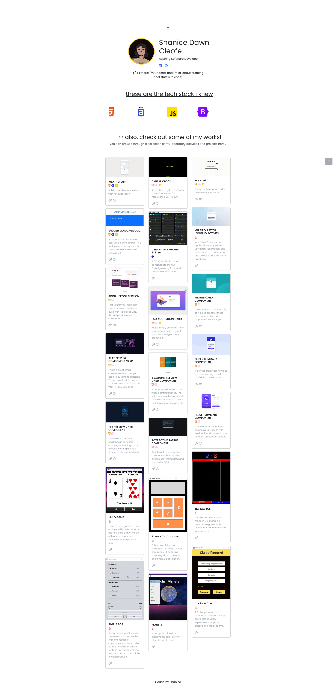
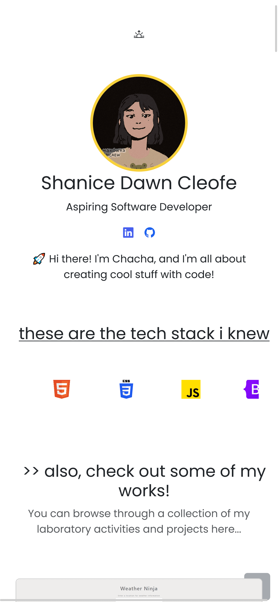

#  My Portfolio's Project Gallery Website
##  Table of contents
-  [Overview](#overview)
	- [Screenshot](#screenshot)
	- [Links](#links)
-  [My process](#my-process)
	- [Built with](#built-with)
	- [Continued development](#continued-development)
##  Overview
This is where my projects are compiled and showcased through the website.

###  Screenshot

Desktop Preview

Mobile Preview

###  Links
- Live Site URL: [ My Portfolio's Project Gallery Website](https://sdacleofe.github.io/my-works/)

##  My process

###  Built with
- Bootstrap
- Splide JS
- Sass

###  Continued development
I plan to include additional projects in the future...
